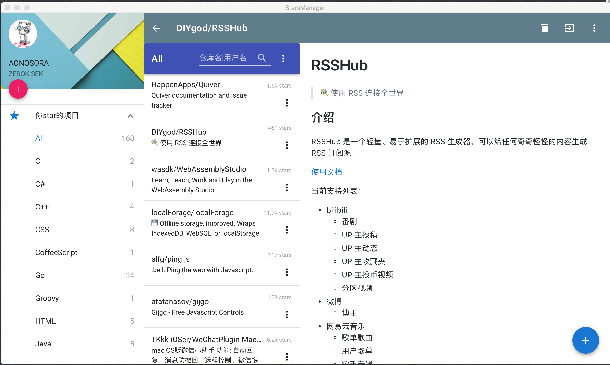
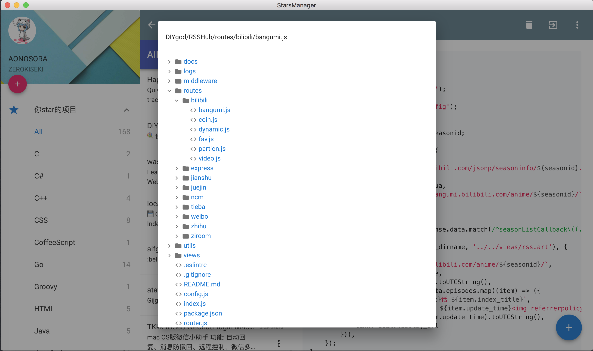
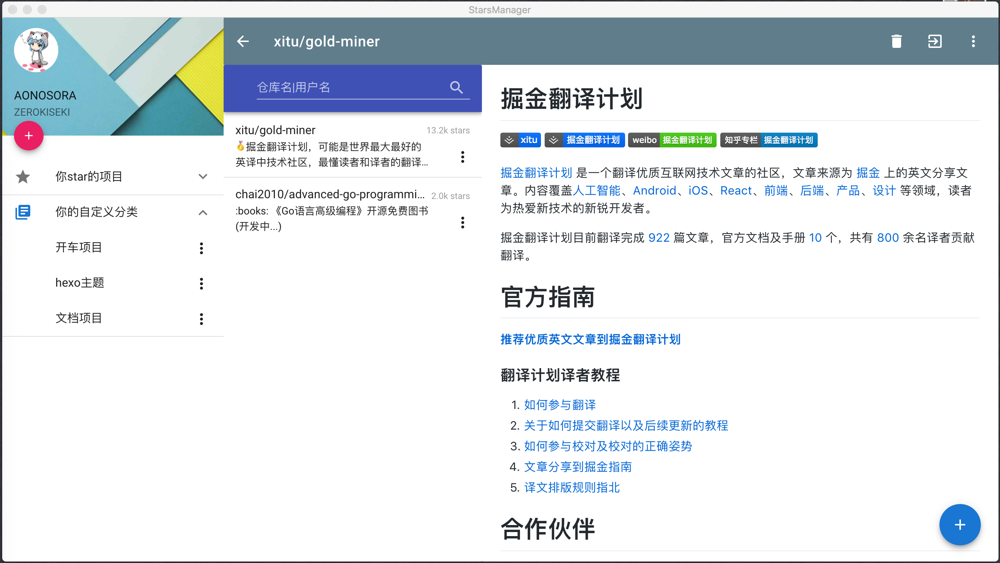

# starsManager

一款基于vue和go的桌面端管理star项目应用

## 前言:

最开始不怎么上github的时候, 自己star的repo很少, 倒也没这个需求, 但是后来github弄得多一些, 自己star的repo也开始多了, 现在大概有一百多个repo, 有些久了都忘了, 不好管理, 受到Quiver和印象笔记这种类型应用的启发, 于是想写个能够方便自己管理star项目的客户端

---

## 开发状态:

仍在开发中..., 你可以在release下载对应的系统版本(下载压缩包并解压缩)

---

## 项目技术栈和主要框架:

Vue全家桶: vue2 + vuex + vue-router  
UI框架: vuetify.js(一款渐进式Material Design框架)  
前端网络请求: axios  
前端数据库: pouchdb  
前端构建工具: parcel  
桌面支持: go-astilectron(thanks to [asticode](https://github.com/asticode)) 

--- 

## 演示效果(未完):

### 查看star的项目:



### 项目结构树查看:



### 自定义分类:



### 利用pouchDB, 离线状态下也可查看:


---

## 安装食用:

### 前端文件打包:

全局安装parcel:  

```
yarn global add parcel-bundler

or

npm install -g parcel-bundler

```

前端文件打包:  

```

$ cd src
$ yarn 
$ npm run build

```

### Golang配置:

首先你得安装golang的环境, 并且设置好了GOROOT和GOPATH(你可以通过`echo $GOROOT`, `echo $GOPATH`来查看是否已经设置了)  

安装go-astilectron和go-astilectron-bundler等依赖:  

```
$ go get -u github.com/asticode/go-astilectron
$ go get -u github.com/asticode/go-astilectron-bundler/...
$ go get github.com/ZEROKISEKI/go-astilectron-bootstrap

```

如果你在上面的get的过程遇到了`unrecognized import path "golang.org/x/ ..."`这样的问题，那么可以利用镜像库解决:  

```
$ mkdir -p $GOPATH/src/golang.org/x
$ cd $GOPATH/src/golang.org/x
$ git clone https://github.com/golang/crypto.git
$ git clone https://github.com/golang/net.git
$ git clone https://github.com/golang/sys.git
```

然后你可以在项目下运行bundler进行生成:  

```
$ astilectron-bundler -v
```

在bundler生成的过程中, 会去download electron和astilectron, 如果你遇到了download electron过慢导致failed的问题, 那么可以这样做:  

在[https://github.com/electron/electron/releases?after=v1.8.2-beta.2](https://github.com/electron/electron/releases?after=v1.8.2-beta.2)选择对应系统下的electron版本  

然后在该项目下新建一个文件夹, 比如叫`cache_astilectron_bundler`, 那么将该electron文件进行更名:

```
electron-windows-amd64-1.8.1.zip(windows系统)
electron-darwin-amd64-1.8.1.zip(OSX系统)
electron-linux-amd64-1.8.1.zip(linux系统)
```

再在[https://github.com/asticode/astilectron/releases](https://github.com/asticode/astilectron/releases)下载0.20.0的版本, 放在上面新建的文件夹中:

更名为:

```
astilectron-0.20.0.zip
```

最后在`bundler.json`中增加:

```
"cache_path": "cache_astilectron_bundler"
```

这样的话bundler就不用去download了, bundler应该可以了

通过bundler之后, 可以在output文件夹下找到对应的可执行文件(windows的exe, mac的app), 当然也可以通过run go去运行


