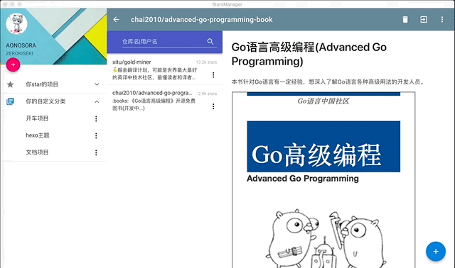

# starsManager

一款基于vue和go的桌面端管理star项目应用

## 前言:

自己star的repo已经有100多个了, 有一天自己翻了一下列表, 想起来有一堆东西自己也不知道为什么当初star了...(应该是跟风大佬2333), 不过, 我个人认为, 一般在github上star别人的项目无非有以下几点:

- 这个项目在当前或者之后的项目中用到, star了以防自己以后忘记找不到(比如前端经常用到的一堆npm包那种)
- 要对这个项目的源码实现等进行研究细读(比如Vue, React之类的)
- 实用型项目(比如SS, lantern, 还有一些开车项目之类的...)
- 开源书籍文档之类的
- 其他原因, 比如出于对作者的鼓励, 或者就是跟风大佬star, 或者就是认识的人互粉这样的...

至于fork别人的项目, 一般就是你要进行一些对应的修改, 然后将修改PR到原项目中, 才是进行fork的, 这个倒没有必要细究了

我star项目的原因主要是前面三种, 但是star的一多自己也给忘了, 感觉这样不好, 于是想写一个方便自己管理star项目的客户端

正好自己没怎么写过桌面端应用, 也算是一次实践练习了, 项目地址[https://github.com/ZEROKISEKI/starsManager/](https://github.com/ZEROKISEKI/starsManager/)

---

## 技术选用:

桌面web化的一般可以用electron作为支持, 而前端方面稍微会写一点的就是vue, 那么有一个对应的支持[electron-vue](https://github.com/SimulatedGREG/electron-vue), 但是一般我们知道, 与系统API的交互由electron提供的API或者是有node.js去搞, 然后通过ipc之类的进行消息传递, 而由于最近是入门了golang, 所以在想能不能用前端代码去写用户表现, 而用golang作为系统API交互支持, 然后就找到了[go-astilectron](https://github.com/asticode/go-astilectron)这个项目:

> Thanks to go-astilectron build cross platform GUI apps with GO and HTML/JS/CSS. It is the official GO bindings of astilectron and is powered by Electron.

Go和Javascript可以通过sendMessage和OnMessage等接口进行消息的传递, 接下来是前端的选择, 如下所示, 其中parcel, vuetify, pouchdb都是第一次使用:

Vue全家桶系列: Vue2 + Vue-router + Vuex + Vue-i18n  
前端模块打包构建: parcel  
UI框架: Vuetify(一款渐进式Material Design框架)  
前端数据库: Pouchdb  
网络请求: axios  
代码高亮和markdown渲染: github-markdown-css(自己造轮子不如用别人的轮子系列)  

--- 

## 开发状态:

仍在开发中...

---

## 演示效果(未完):

登录可以选择英文或者中文:


使用OAuth登录后, 可以看到你已经starred的repo的分类(按language):


代码文件和markdown文件均进行了渲染, 并且写了一个directive, 防止无法加载如**./xxx,../xxx,#xxx**这种url地址:


研究了octotree的部分源码, 自己也写了个可以查看项目代码树的组件:


自定义分类:


http://p0w4szagp.bkt.clouddn.com/starsManager/customized_classification_3.gif


离线环境下可以查看之前加载过的文件:



---

## 安装食用:

### 前端文件打包:

全局安装parcel:  

```
yarn global add parcel-bundler

or

npm install -g parcel-bundler

```

前端文件打包:  

```

$ cd src
$ yarn 
$ npm run build

```

### Golang配置:

首先你得安装了Golang, 并且设置好了$GOROOT和$GOPATH等变量, 如果没有配置过, 那么可以参考[build-web-application-with-golang](https://github.com/astaxie/build-web-application-with-golang/)教程配置

如果上面的部分已经配置好了, 那么接下来要安装`go-astilectron`相关依赖:

```

$ go get -u github.com/asticode/go-astilectron
$ go get -u github.com/asticode/go-astilectron-bundler/...
$ go get github.com/ZEROKISEKI/go-astilectron-bootstrap

```

在天朝的话, 上面get的过程八成会遇到这个错误

```

unrecognized import path "golang.org/x/ ..."

```

关于这个错误, 如果不能翻墙的话, 可以用golang的github镜像库去解决:

```
$ mkdir -p $GOPATH/src/golang.org/x
$ cd $GOPATH/src/golang.org/x
$ git clone https://github.com/golang/crypto.git
$ git clone https://github.com/golang/net.git
$ git clone https://github.com/golang/sys.git

```

git clone完之后可以重新`go get`, 应该就可以了, 此时可以通过bundler命令进行桌面可执行文件生成, 但是我们要先进行前端部分的build, 如果你没有安装parcel, 那么先全局进行安装parcel, 再进行build:

```

yarn global add parcel-bundler

or 

npm install parcel-bundler -g

```

```

$ cd src
$ yarn or npm install
$ npm run build

```

接下来可以可以bundler了:

```
$ cd ..
$ astilectron-bundler -v

```

上面那一步会去下载astlectron和electron, 天朝的话八成又会出问题了, 就是download没速度或者过于缓慢导致failed, 针对这点, 可能这样:

首先, 在当前项目建立一个文件夹, 比如**cache_astilectron_bundler**, 然后在**bundler.json**中添加一行代码:

```

"cache_path": "cache_astilectron_bundler"

```

然后可以在[https://github.com/electron/electron/releases?after=v1.8.2-beta.2](https://github.com/electron/electron/releases?after=v1.8.2-beta.2)找到对应你系统的**electron 1.8.1**的版本, 放在**cache_astilectron_bundler**中, 并且做以下更名:

```

electron-windows-amd64-1.8.1.zip(windows系统)
electron-darwin-amd64-1.8.1.zip(OSX系统)
electron-linux-amd64-1.8.1.zip(linux系统)

```

在[https://github.com/asticode/astilectron/releases](https://github.com/asticode/astilectron/releases)下载astilectron的0.20.0版本, 同样放在**cache_astilectron_bundler**中, 更名为:

```

astilectron-0.20.0.zip

```

当然, 如果你想在同一台pc同时bundler三个系统的版本, 那么要下三个对应版本的electron 1.8.1, 并且做上面的更名, 都放在**cache_astilectron_bundler**中, 然后在bundler.json中添加以下代码:

```

"environments": [
    {"arch": "amd64", "os": "darwin"},
    {"arch": "amd64", "os": "linux"},
    {"arch": "amd64", "os": "windows"}
  ],

```

接下来应该可以bundler生成对应的二进制可执行文件了.默认生成地址是在当前项目的output文件夹中


